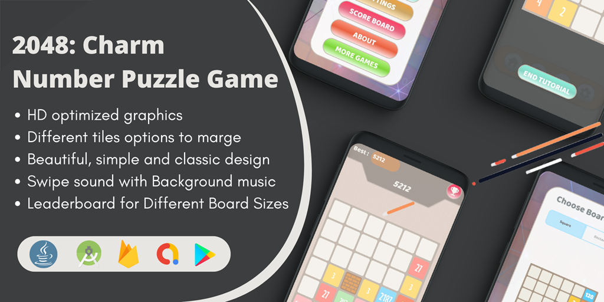

<p align="center">
  <h1 align="center">2048: Charm Number Puzzle Game For Android</h1>
  <h4 align="center">Marge Tiles Brain Puzzle 2048 Game. Very simple game yet insanely addictive!
 </h4>

<div align="center">
  
<a href="mailto:banrossyn@gmail.com"></a>
[](https://instagram.com/rohitraj.khorwal) [](https://www.linkedin.com/in/rohitrajkhorwal/) [](https://medium.com/@rohitrajkhorwal) 

</div>


 <p align="center">
    <a >
      
    </a>
  </p>

### Game Details:

The good old classic 2048 with new features.
Random Blocks will spawn in your Board.
Your Board Knows how to Shuffle.
Choose Different Exponents 2,3,4 and 5.


<p align="center">
     <a href="">
      
    </a>
  </p>


### Features:
    ✪ block tiles in Game
    ✪ A best graphic puzzle game.
    ✪ Different tiles options to marge.
    ✪ completely native implementation.
    ✪ keep playing any part of the screen.
    ✪ beautiful, simple and classic design.
    ✪ click and swipe sound with Background music.
    ✪ High score and leaderboard for all board sizes.
    ✪ Always free with no purchase required official version  of the original puzzle game.


### Board Size:

Square

      3X3, 4X4, 5X5, 6X6.
Rectangle

      4X3, 5X3, 5X4, 6X5.


### About
When two tiles with the same number touch, they merge into one. When a 2048 tile is created, the player wins! 8 ., 16 ., 128 ., 1024 ., 2048.
2048 is played on a plain 4×4 grid,consisting of numbered tiles that slide when a player moves them using the four arrow keys. On each turn, a new tile randomly appears on an empty spot on the board with a value of 2 or 4. The tiles slide as far as possible in the chosen direction until they are stopped by another tile or the edge of the grid.If two tiles of the same number collide while moving, they will merge into one tile with the total value of the two tiles colliding.The resulting tile cannot merge with any other tile in the same move again. High scoring tiles emit a soft glow; The highest possible tile is 131,072. If a move causes three consecutive tiles of the same value to move simultaneously, only the two tiles that are farthest in the direction of motion will combine. If all four spaces in a row or column are filled with tiles of the same value, a move parallel to that row/column will add the first two and the last two. A scoreboard in the top right keeps track of the user's score. The user's score
sart at zero, and increases by the value of the new tile each time two tiles meet. The game is won when a tile with the value 2048 appears on the board. Players can go beyond this and reach higher scores. When the player has no legal moves (there are no spaces and no adjacent tiles with the same value), the game ends.

### Find this Repository useful? ❤️

Support it by joining stargazers for this repository. ⭐

Also, [follow me on GitHub](https://github.com/AndroidWithRossyn/) for my next creations! 🤩

### :zap: Latest Medium Articles

<!-- ARTICLES:START -->

<!-- ARTICLES:END -->

### Graphics
---

 <p align="center">
    <a>
      
    </a>
   <a>
      
    </a>
     <a>
      
    </a>
     <a>
      
    </a>
     <a>
      
    </a>
    <a>
      
    </a>

  </p>


### License

```
Copyright 2023 Rossyn

Licensed under the Apache License, Version 2.0 (the "License");
you may not use this file except in compliance with the License.
You may obtain a copy of the License at

   http://www.apache.org/licenses/LICENSE-2.0

Unless required by applicable law or agreed to in writing, software
distributed under the License is distributed on an "AS IS" BASIS,
WITHOUT WARRANTIES OR CONDITIONS OF ANY KIND, either express or implied.
See the License for the specific language governing permissions and
limitations under the License.
```

<p align="center">
  
</p>
